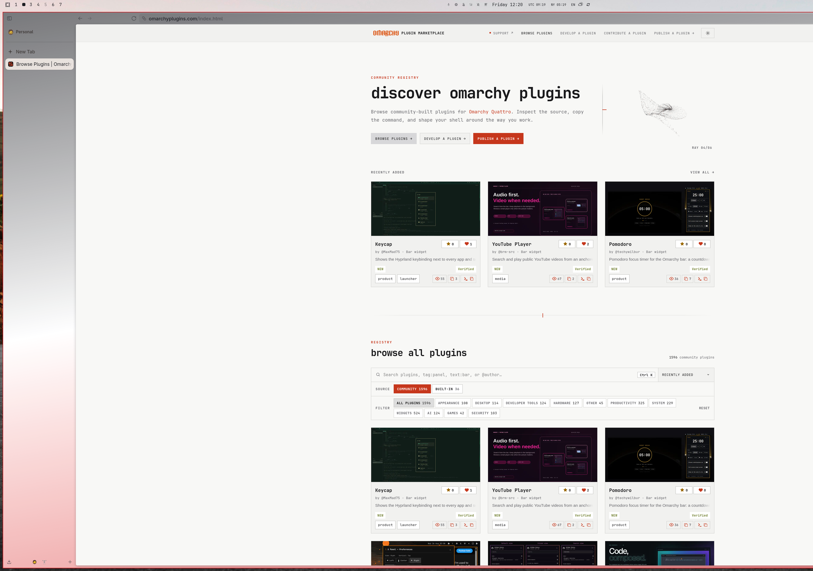
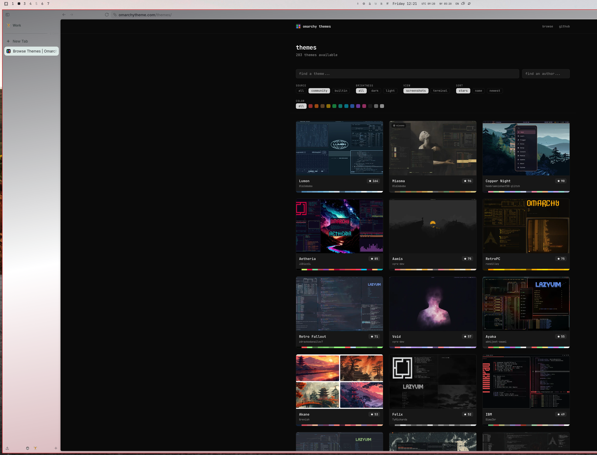

# omarchy-zen-sync

Sync [Zen Browser](https://zen-browser.app/)'s interface colors with your active
[Omarchy](https://omarchy.org/) theme — automatically, on every `omarchy theme set`.

No patched builds, no Zen Mods, no manual color picking. The whole thing is one
CSS template rendered by Omarchy's native theming engine, plus a tiny hook that
restarts Zen so it picks the colors up.

The same Omarchy theme (**Quattro Light**) in two Zen Spaces — each Space gets
its own gradient tint:

| Space 1 — `accent` tint | Space 2 — `magenta` tint |
|---|---|
|  |  |

## How it works

Zen derives its entire UI palette from a handful of root CSS variables
(`--zen-primary-color`, `--zen-branding-bg`, `--toolbox-textcolor`, …) via
`color-mix()`. Instead of restyling elements one by one, this project overrides
**only those root variables** with your Omarchy theme colors and lets Zen
compute every hover/active/panel shade itself. That's why it looks native with
any theme — dark or light.

The pipeline:

```
omarchy theme set <name>
  └─ colors.toml changes → sync.py renders zen-userchrome.css.tpl
       └─ ~/.local/state/omarchy-zen-sync/zen-userchrome.css
            └─ symlinked as userChrome.css in your Zen profile
  └─ Zen is gracefully restarted, only if the rendered CSS changed
```

In plugin mode a headless shell service watches `colors.toml`; in manual mode
a `theme-set` hook runs the same renderer.

## Features

- **Full palette sync** — accent, backgrounds, text, borders, dialogs, urlbar,
  all derived from the theme's `colors.toml`.
- **Light & dark themes** — `color-scheme` follows the theme's mode, and is
  forced consistently so a Space's custom gradient can't flip parts of the UI
  into the wrong scheme (no more dark-on-dark text).
- **Theme-colored background gradient** — a near-vertical gradient along the
  sidebar: selection tint → background → accent tint.
- **Per-Space gradient variants** — each Zen Space gets its own bottom tint,
  rotating through the theme palette (see table below), so you can tell Spaces
  apart at a glance while everything stays on-theme.
- **Automatic restart** — a `theme-set` hook restarts Zen after every theme
  change (Zen only reads `userChrome.css` at startup). Zen's session restore
  brings all tabs back.

### Per-Space tints

| Space | Gradient bottom color |
|-------|-----------------------|
| 1     | `accent`              |
| 2     | `magenta`             |
| 3     | `yellow`              |
| 4     | `green`               |
| 5     | `red`                 |
| 6     | `cyan`                |

(`magenta` comes second because in many themes `accent` *is* `blue`.)

## Requirements

- Omarchy that ships `omarchy-theme-color` (present since themed templates
  landed); `python3` for descriptor-bound file reads (in Omarchy's dependency
  tree already)
- Zen Browser (AUR `zen-browser-bin`, tarball, or flatpak)
- Hyprland (used to restart Zen with the correct session environment; falls
  back to `setsid` elsewhere)

## Install

### As an Omarchy plugin (recommended)

```bash
omarchy plugin add https://github.com/aonatsky/omarchy-zen-sync.git --enable
```

That's it. A headless shell service watches the active theme and re-renders /
restarts Zen whenever it changes. The first run wires your Zen profiles
automatically (enables the userChrome pref and symlinks `userChrome.css`; an
existing `userChrome.css` is backed up, never deleted).

To remove it later: `omarchy plugin remove io.github.aonatsky.zen-sync`, then
run `./uninstall.sh` from a clone if you also want the symlinks and rendered
CSS gone.

### Manual (hook mode)

An alternative that doesn't involve the Omarchy shell. Don't combine it with
the plugin, pick one.

```bash
git clone https://github.com/aonatsky/omarchy-zen-sync.git
cd omarchy-zen-sync
./install.sh
```

The installer copies the renderer and template to
`~/.local/share/omarchy-zen-sync/`, installs a `theme-set` hook that runs it,
and runs it once (which wires your Zen profiles the same way plugin mode
does). From that point on, every `omarchy theme set <name>` does everything by
itself.

## Customization

Everything lives in one file, `zen-userchrome.css.tpl`, next to the renderer
(the plugin directory in plugin mode, `~/.local/share/omarchy-zen-sync/` in
hook mode). Any Omarchy color key works as `{{ key }}`, including `{{ mode }}`
(`light`/`dark`) and derived shades like `{{ lighter_background }}`. After
editing, re-apply your theme: `omarchy theme set "$(omarchy theme current)"`.

Common tweaks:

- **Gradient strength** — the `color-mix(... 55%, ...)` percentages.
- **Gradient direction** — the `170deg` angle (near-vertical keeps it visible
  along the sidebar; diagonal corners hide behind the web content).
- **Per-Space colors** — reorder the `{{ magenta }}` / `{{ yellow }}` / … tokens
  in the `nth-of-type(N)` blocks.
- **Bookmarks bar text** — tuned to match the tab labels; adjust the `88%` mix.

## Troubleshooting

**Web content / new-tab renders light on a dark theme.** Zen was launched
without the session's DBus/portal environment, so it can't read the system
color scheme. Restart it from your launcher or via the hook (which uses
`hyprctl dispatch exec` exactly for this reason).

**Zen's theme picker still shows old gradient dots.** The picker edits Zen's
stored per-Space gradient, which this project overrides — it's inert. Reset the
Space gradients to default in the picker if the stale state bothers you.

**Colors didn't change after `omarchy theme set`.** The theme must ship a
`colors.toml` (all stock themes do). In hook mode, also check that the hook is
executable: `ls -l ~/.config/omarchy/hooks/theme-set.d/50-zen-sync`.

## Security

The renderer (`sync.py`) treats all inputs as untrusted data and all
filesystem access is descriptor-bound:

- Directory anchors are canonicalized once, then walked
  component-by-component with `O_NOFOLLOW|O_DIRECTORY`; the resulting
  directory descriptors are held, and every read, temporary creation,
  rename, backup, and symlink runs *at* those descriptors (`openat`,
  `renameat`, `linkat`, `symlinkat`). A swapped or symlinked intermediate
  component fails the walk at use time instead of being followed.
- File reads open with `O_NOFOLLOW|O_NONBLOCK` and verify type, owner, and
  size via `fstat` on the open descriptor before reading through that same
  descriptor (symlinks, FIFOs, devices, foreign-owned, and oversized files
  are refused without blocking).
- `omarchy-theme-color` never sees an on-disk path: the verified
  `colors.toml` bytes are passed as an in-memory file (`memfd`) through
  `/proc/self/fd`.
- Theme keys/values are never used to build executable syntax. Keys must
  match `[a-z0-9_]+` and values must match an allowlisted grammar (hex color,
  `r,g,b` triplet, or `light`/`dark`); anything else is dropped, and an
  unresolved template token aborts the render.
- `profiles.ini` entries are component-validated (no absolute, empty, dot,
  or backslash segments) and walked from the held profile-root descriptor.
- Every write is an unpredictable `O_CREAT|O_EXCL` temporary in the
  destination directory followed by an atomic rename. The shell service
  never loads the watched file's content; it only reacts to change events.
- Nothing is fetched or executed from the network at runtime.

## Uninstall

```bash
./uninstall.sh
```

Removes the template, the hook, and the symlinks; restores any backed-up
`userChrome.css`.

## License

MIT
